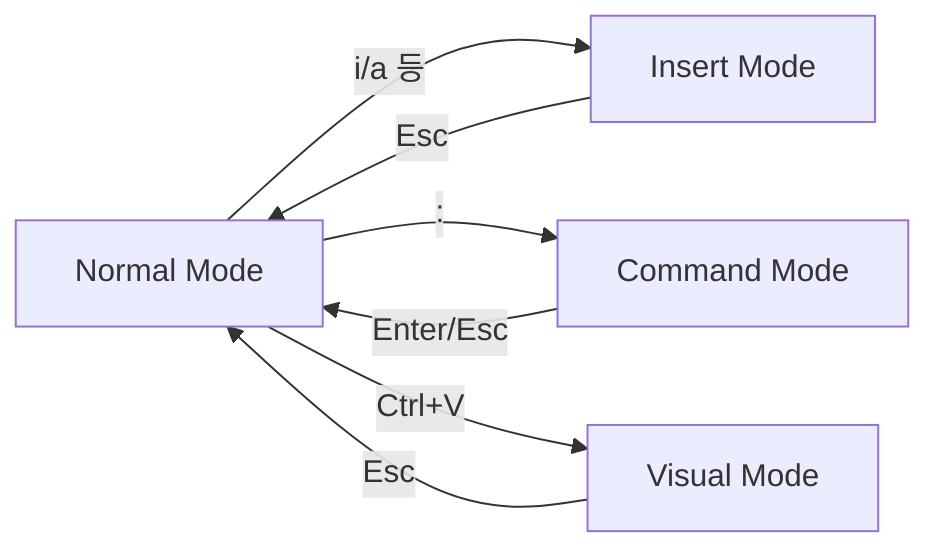
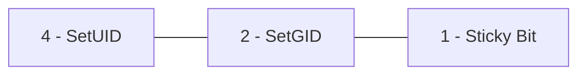

## 목차

1. [[#1. 쉘(Shell) 기본]]
2. [[#2. 파일/디렉토리 관리]]
3. [[#3. 검색 - find / grep]]
4. [[#4. 기타 유틸리티 - id / history]]
5. [[#5. VI Editor]]
6. [[#6. 계정과 권한 구조 - passwd / shadow / group]]
7. [[#7. 권한 관리 - chmod / chown / chgrp / 특수 권한]]
8. [[#8. 프로세스 관리]]
9. [[#9. 스케줄링 - cron]]

---

## 1. 쉘(Shell) 기본

|명령어|설명|
|---|---|
|`echo $SHELL`|현재 사용 중인 쉘 확인|
|`chsh`|사용자의 기본 쉘 변경|
|`chsh -l`|시스템에 등록된 쉘 목록 확인|
|`echo hello world`|문자열/데이터를 터미널에 출력|

```bash
cat /etc/passwd | grep username   # 특정 계정 정보만 필터링해서 확인
```

---

## 2. 파일/디렉토리 관리

### 리스트 확인 - `ls`

|옵션|설명|
|---|---|
|`ls`|단순 파일/디렉토리 리스트|
|`ls -a`|숨김 파일/디렉토리까지 표시|
|`ls -l`|파일/디렉토리 상세 정보(권한, 소유자, 크기 등)|
|`ls -h`|파일 크기를 byte 대신 사람이 읽기 편한 단위(K/M/G)로 출력|
|`ls -d`|디렉토리 자체의 상세 정보 (내부 목록이 아닌 디렉토리 항목만)|
|`ls -R`|하위 디렉토리까지 재귀적으로 출력|

```bash
ls [옵션] [경로]
ls                          # 현재 디렉토리 기준
ls /home/kisec/test.txt
ls ./test.txt
```

### 생성 - `touch` / `mkdir`

```bash
touch test.txt      # 데이터 없는 빈 파일 생성
mkdir new_folder     # 빈 디렉토리 생성
```

### 삭제 - `rm` / `rmdir`

|명령어|설명|
|---|---|
|`rm <파일>`|파일 삭제|
|`rmdir <빈 디렉토리>`|**비어있는** 디렉토리만 삭제 가능|
|`rm -r <디렉토리>`|디렉토리와 하위 파일/디렉토리를 전부 재귀적으로 삭제|
|`rm -f`|확인 메시지 없이 강제 삭제|
|`rm -rf`|위 둘을 합친, **실무에서 가장 많이 쓰지만 가장 위험한** 조합|

```bash
rm [옵션] [삭제 경로]
```

### 이동 - `mv`

```bash
mv <이동시킬 파일/디렉토리> <이동할 위치>
mv ./test.txt ./Desktop
```

### 복사 - `cp`

```bash
cp [복사할 파일/디렉토리] [복사될 위치]
cp -r  # 디렉토리 복사 시 하위 데이터까지 전부 복사 (디렉토리 복사엔 필수 옵션)
```

### 파일 내용 확인 - `cat`

```bash
cat <파일 이름(경로 포함)>
cat hello.txt
```

### 경로 이동/확인

|명령어|설명|
|---|---|
|`cd [경로]`|작업 디렉토리 위치 변경|
|`pwd`|현재 작업 중인 디렉토리의 절대 경로 출력|

**절대 경로 vs 상대 경로**

|구분|설명|
|---|---|
|**절대 경로**|`root(/)`를 기준으로 전체 경로를 명시|
|**상대 경로 `./`**|현재 경로 기준 (현재 위치 및 하위)|
|**상대 경로 `../`**|현재 경로보다 한 단계 상위 경로|

### 파이프 / 리다이렉션

```bash
# 파이프(|) : 앞 명령어의 출력 결과를 뒤 명령어의 입력으로 사용
ls -l | sort

# 리다이렉션 : 명령어 출력 방향 지정
echo hello world > hello.txt    # >  : 덮어쓰기
echo hello world >> hello.txt   # >> : 이어쓰기 (기존 내용 유지 + 추가)
```

---

## 3. 검색 - find / grep

### find - 파일/디렉토리 검색

```bash
find <경로> [옵션1] [옵션2]
```

|옵션|설명|
|---|---|
|`-nouser`|소유자가 존재하지 않는 파일 검색|
|`-nogroup`|소속 그룹이 지정되지 않은 파일 검색|
|`-name`|파일 이름 기반 검색|
|`-perm`|권한 기반 검색|
|`-type`|특정 유형(파일 `f` / 디렉토리 `d` 등) 검색|
|`-size [크기]`|파일 크기 기반 검색. `+`/`-`로 이상/이하 지정, `K/M/G` 단위|
|`-mtime [일수]`|내용 수정(modify) 시간 기준 검색|
|`-ctime [일수]`|파일 속성/권한 변경(change) 시간 기준 검색|
|`-atime [일수]`|파일 접근(access) 시간 기준 검색|
|`-exec [명령어] {} \;`|검색된 결과 각각에 대해 명령어 실행|

> [!warning] 문법 정정 원본에 `find / -exec [명령어] {} \n`이라고 되어있었는데, 올바른 종결 문자는 **`\;`**(백슬래시 + 세미콜론)입니다. `\n`은 개행 문자를 뜻해 문법 오류가 납니다.
```bash
find / -size +10M            # 10MB 이상 파일 검색
```

### grep - 패턴 기반 검색/추출

```bash
grep [옵션] <패턴> <파일/입력>
```

|옵션|설명|
|---|---|
|`-i`|대소문자 구분 없이 검색|
|`-v`|패턴에 **매칭되지 않는** 나머지 검색 (제외 검색)|
|`-r`|하위 경로까지 재귀적으로 검색|

---

## 4. 기타 유틸리티 - id / history

|명령어|설명|
|---|---|
|`id`|현재 접속 계정의 UID, GID, 소속 그룹 확인|
|`history`|지금까지 사용한 명령어 히스토리 확인|
|`history -c`|히스토리 전체 삭제|
|`!<번호>`|해당 번호의 히스토리 명령어 재실행|
|`!!`|가장 마지막 명령어 재실행|
|`!<명령어>`|해당 문자열로 시작하는 가장 최근 명령어 재실행|

---

## 5. VI Editor

vi는 4가지 모드로 동작한다.



### Normal Mode (기본 진입 모드)

|키|동작|
|---|---|
|`yy`|한 줄 복사|
|`nyy`|n줄 복사|
|`dd`|한 줄 삭제|
|`ndd`|n줄 삭제|
|`p`|붙여넣기|
|`u`|실행 취소(undo)|
|`Ctrl + r`|되돌리기 취소(redo)|

### Insert Mode

`i` 키로 진입, 실제 파일 내용을 입력/수정하는 모드.

### Command Mode

`:` 로 진입, 저장·종료·검색·치환 담당.

|명령어|설명|
|---|---|
|`:w`|저장|
|`:q`|나가기|
|`:wq`|저장 후 나가기|
|`:q!`|변경사항 무시하고 강제로 나가기|
|`/<키워드>`|아래쪽으로 키워드 검색, `n`/`N`으로 다음/이전 이동|
|`:set [옵션]`|vi 옵션 설정 (예: `:set nu` 줄번호 표시)|
|`:%s/<대상>/<변경값>/g`|전체 치환|
|`:!<명령어>`|vi를 빠져나가지 않고 쉘 명령어 실행|

### Visual Mode

`Ctrl + v`로 진입 (블록 단위 선택 - Visual Block Mode).

|동작|키|
|---|---|
|블록 선택 후 일괄 삭제|`s`|
|블록 선택 후 일괄 변경(맨 앞에 문자열 삽입)|`Shift + i`|

### 실습 예시 - 읽기 전용 파일 편집

```bash
sudo cp /etc/login.defs ./
# /etc/login.defs : 사용자/그룹 생성, 로그인 정책의 핵심 설정 파일

# 복사된 파일이 readonly 권한이라 아래 명령어로 소유권 변경 필요
sudo chown (user):(user) login.defs
```

---

## 6. 계정과 권한 구조 - passwd / shadow / group

### /etc/passwd - 계정 기본 정보

```bash
sudo useradd test
cat /etc/passwd | tail -2
```

```
kisec:x:1000:1000:kisec:/home/kisec:/bin/sh
test:x:1001:1001::/home/test:/bin/bash
```

`계정명:패스워드필드:UID:GID:설명:홈디렉토리:로그인쉘` 구조이며, **비밀번호 필드는 `x`로 표시**되고 실제 해시는 `/etc/shadow`에 별도 저장된다.

### /etc/login.defs - UID 정책 확인

```bash
cat /etc/login.defs | grep UID
```

```
UID_MIN                  1000
UID_MAX                 60000
SYS_UID_MIN               201
SYS_UID_MAX               999
```

`UID_MIN`/`UID_MAX`는 일반 사용자 계정에 할당되는 UID 범위, `SYS_UID_*`는 시스템 계정용 UID 범위를 의미한다.

### /etc/shadow - 비밀번호 해시 (root 권한 필요)

```bash
sudo -s
cat /etc/shadow
```

```
kisec:$y$j9T$M0bPQ7C1A32tYdlMxnvYJ00b$D./z0YntT.y8uGn950hfkr7qELMgbS1Vv4/f5eDvFd8::0:99999:7:::
test:!:20651:0:99999:7:::
```

|식별자|알고리즘|
|---|---|
|`$1$`|MD5|
|`$5$`|SHA-256|
|`$6$`|SHA-512|
|`$y$`|yescrypt (최신 기본값)|
|`!` 또는 `*`|비밀번호 로그인 비활성화(계정 잠금)|

필드 구조: `계정:해시:마지막변경일:최소사용기간:최대사용기간:경고기간:비활성기간:만료일`

### /etc/group - 그룹 및 sudo 권한 계정 확인

```bash
cat /etc/group
```

```
wheel:x:10:(user1),(user2)
```

`wheel` 그룹에 속한 계정은 **sudo 명령어 사용이 가능**한 계정이다. (배포판에 따라 `sudo` 그룹을 쓰기도 함)

```bash
su - <유저명>   # 다른 계정으로 전환 (- 옵션은 해당 유저의 환경변수까지 함께 적용)
```

---

## 7. 권한 관리 - chmod / chown / chgrp / 특수 권한

### 기본 권한 변경

```bash
chmod 644 test.txt      # 숫자 표기법
chmod u+x test.txt      # 기호 표기법 - 소유자(u)에 실행권한(x) 추가
chmod g+wx test.txt     # 그룹(g)에 쓰기+실행 권한 추가
```

|대상|기호|
|---|---|
|소유자|`u`|
|그룹|`g`|
|기타 사용자|`o`|
|전체|`a`|

> [!important] 권한 진단 시 주의사항 (원본 강조 내용) 권고 기준이 "A파일 644 이하 / B파일 644 이하"일 때, 실제 값이 A=640, B=642라면 **둘 다 권고 기준(644)보다 낮은 값이라 '양호'로 판단**해야 한다. 숫자가 작다고 무조건 이상하다고 판단하면 안 되고, **권고 기준 이하인지**를 기준으로 본다.
> 
> - 644 = `rw-r--r--`
> - 640 = `rw-r-----`
> - 642 = `rw-r---w-` (그룹 실행권한 없이 기타 사용자에 쓰기 권한이 있는 특이 케이스라 별도 확인 필요)

### 특수 권한 (SetUID / SetGID / Sticky Bit)

일반 권한 3자리 앞에 숫자 1자리가 추가되어 **총 4자리**로 표현된다.



|특수 권한|값|설명|표기 위치|
|---|---|---|---|
|**SetUID**|4000|실행 시 **파일 소유자**의 권한으로 임시 실행됨. 프로세스 종료 시 권한 반환|소유자 실행 위치에 `s`|
|**SetGID**|2000|실행 시 **파일 소유 그룹**의 권한으로 임시 실행됨. 프로세스 종료 시 권한 반환|소유그룹 실행 위치에 `s`|
|**Sticky Bit**|1000|디렉토리에 주로 적용. 누구나 파일 생성 가능하지만, **자신이 만든 파일은 본인(또는 root)만 삭제/이름변경 가능**|기타 사용자 실행 위치에 `t`|

**예시 (SetUID)**

```
4755 => rwsr-xr-x   (소유자 실행권한 자리에 소문자 s)
```

**대문자 S/T가 나오는 경우**

```
rwsr-xr-x => chmod u-s => rwxr-xr-x   (실행권한 o 존재 → 소문자 s)
rwSr-xr-x => chmod u-s => rw-r-xr-x   (실행권한 x 없음 → 대문자 S, 의미없는 SetUID로 취약점/오설정 신호)
```

### 특수 권한 기반 파일 검색 (find) - 권한 상승(Privilege Escalation) 점검

```bash
find / -perm 4000                              # SetUID만 켜진 (다른 실행권한 없는) 파일
find / -perm -4000                              # SetUID가 포함된 모든 파일 (4000~4777)
find / -perm -4000 2>/dev/null                   # 에러 메시지 숨기고 검색
find / -perm -4000 -exec ls -l {} \; 2>/dev/null # 검색 결과에 상세 정보까지 출력
```

---

## 8. 프로세스 관리

|명령어|설명|
|---|---|
|`ps`|현재 실행 중인 프로세스 정보 확인|
|`ps -ef`|상세 정보(PPID, 시작 시간, 터미널 등)까지 출력|
|`pstree`|프로세스를 부모-자식 트리 형태로 출력|
|`jobs`|백그라운드에서 실행/중단 중인 작업 목록|
|`fg`|백그라운드 → 포그라운드 전환|
|`bg`|중단된 작업을 백그라운드로 재개|

```
root   12593   11966  0 16:24 pts/3    00:00:00 ps -ef
```

### 데몬(Daemon) / 서비스 관리 - systemctl

```bash
systemctl list-units --type=service     # 등록된 서비스(데몬) 목록 확인
systemctl <start/stop/restart/reload/status> <service명>
```

---

## 9. 스케줄링 - cron

### crontab 명령어

|명령어|설명|
|---|---|
|`crontab -e`|현재 사용자의 cron 작업 편집|
|`crontab -l`|현재 사용자의 cron 작업 목록 확인|
|`crontab -r`|현재 사용자의 cron 작업 전체 삭제|
|`crontab -u <user> -l`|(root 권한) 특정 사용자의 cron 작업 확인|

### cron 시간 형식

```
*    *    *    *    *   명령어
┬    ┬    ┬    ┬    ┬
│    │    │    │    └── 요일 (0-7, 0과 7은 일요일)
│    │    │    └─────── 월 (1-12)
│    │    └──────────── 일 (1-31)
│    └───────────────── 시 (0-23)
└────────────────────── 분 (0-59)
```

**예시**

```bash
0 3 * * *      /home/kisec/backup.sh     # 매일 새벽 3시 실행
*/10 * * * *   /home/kisec/check.sh      # 10분마다 실행
0 0 1 * *      /home/kisec/monthly.sh    # 매달 1일 자정 실행
0 9 * * 1-5    /home/kisec/weekday.sh    # 평일(월~금) 오전 9시 실행
```

### 시스템 전역 cron 설정

|파일/경로|설명|
|---|---|
|`/etc/crontab`|시스템 전체 cron 설정. 일반 사용자 crontab과 달리 **실행 계정을 명시하는 필드**가 추가로 있음|
|`/etc/cron.d/`|개별 서비스/패키지가 자체적으로 등록하는 cron 설정 디렉토리|
|`/etc/cron.hourly/`, `cron.daily/`, `cron.weekly/`, `cron.monthly/`|주기별로 실행할 스크립트를 넣어두면 자동 실행되는 디렉토리 (별도 시간 지정 불필요)|

`/etc/crontab` 필드 구조 (일반 사용자 crontab과 차이):

```
분 시 일 월 요일 실행계정 명령어
0  3  *  *  *   root   /root/backup.sh
```

### cron 사용 권한 제어 - cron.allow / cron.deny

```bash
vi /etc/cron.allow
vi /etc/cron.deny
```

|상황|동작|
|---|---|
|`cron.allow` 파일이 존재|**목록에 있는 사용자만** cron 사용 가능 (화이트리스트)|
|`cron.allow`가 없고 `cron.deny`만 존재|**목록에 있는 사용자만 차단**, 나머지는 전부 허용 (블랙리스트)|
|둘 다 없음|배포판 기본 정책에 따름 (대부분 root만 허용되거나 전체 허용)|

### 일회성 예약 실행 - at (보완)

cron이 "반복" 작업이라면, `at`은 **한 번만** 실행되는 예약 작업에 사용한다.

```bash
at 10:00 PM          # 오늘 밤 10시에 실행할 명령 입력 대기
at> /home/kisec/oneshot.sh
at> <Ctrl+D>          # 입력 종료

atq                    # 예약된 at 작업 목록 확인
atrm <job번호>          # 예약된 at 작업 취소
```

### cron과 권한 상승 관점 (보안 진단 시 체크포인트, 보완)

- **root 권한으로 실행되는 cron 스크립트의 파일 권한이 허술한 경우**: 일반 사용자가 해당 스크립트를 수정할 수 있으면, 다음 실행 시점에 root 권한으로 임의 명령이 실행됨
- **cron 스크립트가 상대 경로나 `PATH` 미지정으로 외부 명령을 호출하는 경우**: `PATH` 조작을 통해 악성 바이너리를 가로채는 공격(PATH Hijacking) 가능
- 점검 시 다음을 함께 확인하는 것을 권장:
    
    ```bash
    cat /etc/crontabls -al /etc/cron.d/ /etc/cron.daily/crontab -l -u root      # root 계정의 cron 작업 확인 (root 권한 필요)
    ```
    
---
