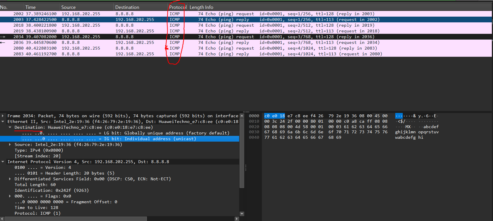

---

### 1. Wireshark 기초 

- **패킷 캡처와 MAC 주소**
	- WireShark에서 캡처 인터페이스를 선택하여 어댑터를 지나가는 Frame, Packet을 볼 수 있다. Frame (2계층), Packet(3계층)
- **MAC 주소 확인**
	- 통신의 시작/도착 지점은 IP만이 아니라 물리 계층에서는 MAC 주소로도 식별됨. 같은 로컬 네트워크(서브넷)에서 통신할 때는 Source/Destination MAC이 게이트웨이(라우터)의 MAC으로 식별되는 경우가 많다
- **MAC 주소 구조**: `00:00:00:00:00:00` 형태의 6바이트(48비트) 주소. `FF:FF:FF:FF:FF:FF`는 브로드캐스트 주소(같은 네트워크의 모든 장치에게 전송)


**ICMP**
- ICMP(Internet Control Message Protocol)는 4계층 전송 계층에서 통신 중 발생하는 오류를 보고하고, 상태 진단하는 프로토콜이 있다. 대표적인 예시로 `ping`, `traceroute`가 있다.
- `ping 8.8.8.8` -> Google Public DNS
- `ping 1.1.1.1` -> Cloudflare Public DNS
  공식적으로 Google과 Cloudflare에서 열어놓은 도메인 주소로 ping 전송을 통해 패킷의 정보를 확인할 수 있다.


**실습**



```bash
C:\Users\ > arp -a
인터페이스: 192.168.202.255 --- 0x8                       --실질적인 물리적 주소와 매핑
```


---

### 2. 터널링 / VPN

- **개념**
	- **터널링** : 네트워크 위 가상의 파이프라인을 구축하는 기술. 엔드포인트 단에서 암/복호화를 수행.
	- **VPN** : 터널링을 활용한 대표 사례.
	- OSI 2계층(데이터링크)는 자체적으로 보안 매커니즘이 부족하기 때문에 3계층 *IPsec* 같은 프로토콜로 보완한다.
