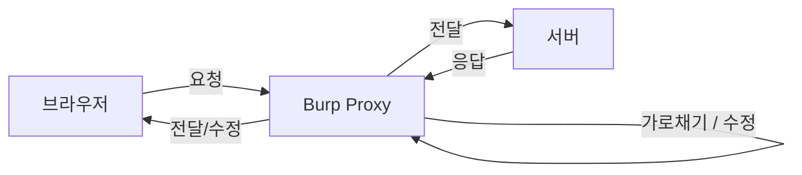

---

## 목차

1. [[#1. Intercept]]
2. [[#2. HTTP Request 구조]]
3. [[#3. HTTP Response]]
4. [[#4. Match and Replace - 자동 치환 도구]]
5. [[#5. HTTP 메서드 총정리]]
6. [[#6. 실전 - 메서드 취약점 진단 흐름]]

---

## 1. Intercept

Burp Suite의 **Proxy → Intercept**는 브라우저와 서버 사이에 Burp가 중간자(Man-in-the-Middle)로 끼어들어, 오가는 요청/응답을 **실시간으로 확인하고 조작**할 수 있게 해주는 핵심 기능이다.



| 동작                      | 설명                                             |
| ----------------------- | ---------------------------------------------- |
| **Intercept is on/off** | 가로채기 기능 자체를 켜고 끔                               |
| **Forward**             | 가로챈 요청/응답을 (수정 후) 다음 단계로 전달                    |
| **Drop**                | 요청 자체를 폐기                                      |
| **Send to Repeater**    | 수정한 요청을 반복 테스트하기 위해 Repeater 탭으로 전송 (`Ctrl+R`) |

---

## 2. HTTP Request 구조 뜯어보기

실습 예시로 사용한 요청:

```http
POST /member/login_ok.asp HTTP/1.1
Host: 121.190.160.232:81
User-Agent: Mozilla/5.0 (Windows NT 10.0; Win64; x64) AppleWebKit/537.36 (KHTML, like Gecko) Chrome/149.0.0.0 Safari/537.36
Referer: http://121.190.160.232:81/member/login.asp
Cookie: JSESSIONID=abc123...

id=admin&pw=1234
```

### 2-1. Request Line

한 줄처럼 보이지만 실제로는 3가지 정보가 들어있다.

```
POST  /member/login_ok.asp  HTTP/1.1
 ↑           ↑                  ↑
Method      Path(URI)      HTTP Version
```

- **Method**: 서버에 요청하는 방식
- **Path**: 요청 대상 리소스 경로
- **Version**: 사용하는 HTTP 프로토콜 버전

### 2-2. Headers - 주요 항목 정리

| 헤더               | 설명                                                                                                                    |
| ---------------- | --------------------------------------------------------------------------------------------------------------------- |
| `Host`           | 접속 대상 서버 주소 + 포트                                                                                                      |
| `User-Agent`     | 접속 클라이언트(브라우저/OS/기타 소프트웨어) 정보                                                                                         |
| `Referer`        | 이 요청 직전에 있었던 페이지(경유지) 주소                                                                                              |
| `Cookie`         | 서버가 `Set-Cookie`로 심어준 값을 클라이언트가 매 요청마다 실어 보냄. 세션ID(`JSESSIONID`, `PHPSESSID` 등)가 담기는 경우가 많아 **세션 하이재킹/변조 실습의 핵심 포인트** |
| `Content-Type`   | Body 데이터 형식 (`application/x-www-form-urlencoded`, `multipart/form-data`, `application/json` 등)                        |
| `Content-Length` | Body 길이(byte)                                                                                                         |
| `Origin`         | 요청이 시작된 출처 — CORS 점검 시 중요                                                                                             |
| `Authorization`  | 인증 토큰/자격증명 (Bearer, Basic 등)                                                                                          |

### 2-3. Body

서버로 실제로 올리는 데이터(파라미터) 또는 업로드 파일이다. 
GET과 달리 URL에 노출되지 않는다.

---

## 3. HTTP Response 구조


```http
HTTP/1.1 200 OK
Content-Type: text/html
Set-Cookie: JSESSIONID=xyz789...

<html>...</html>
```

| 구성              | 설명                                                   |
| --------------- | ---------------------------------------------------- |
| **Status Line** | 프로토콜 버전 + 상태 코드 + 상태 텍스트                             |
| **Headers**     | `Set-Cookie`, `Content-Type`, `Location`(리다이렉트 대상) 등 |
| **Body**        | 실제 응답 데이터. 에러 메시지·디버그 정보 노출 여부 확인 포인트                |

### 대표 상태 코드

| 코드        | 의미            |
| --------- | ------------- |
| 200       | 성공            |
| 301 / 302 | 리다이렉트         |
| 400       | 잘못된 요청        |
| 401 / 403 | 인증 필요 / 권한 없음 |
| 404       | 리소스 없음        |
| 500       | 서버 내부 오류      |

---

## 4. Match and Replace - 자동 치환 도구


- **User-Agent**: 데스크탑에서 접속하면서 UA만 iOS Safari로 바꿔치기가 가능하며 목적은 **모바일 전용 페이지가 따로 있는지, 접근 제어가 UA 값에만 의존하는지** 확인
- **쿠키/세션 토큰 고정 치환**: 매 요청마다 특정 세션값으로 강제 치환
- **파라미터 강제 변경**: `admin=false` → `admin=true`를 모든 요청에 자동 적용 → 권한 상승 취약점 탐색
- **Burp 흔적 제거**: 요청 헤더에서 Burp 관련 시그니처 삭제 → WAF 우회 테스트

---

## 5. HTTP 메서드 총정리

| 메서드         | 정의                                           | 보안 관점                                            |
| ----------- | -------------------------------------------- | ------------------------------------------------ |
| **GET**     | 지정된 URL 정보 요청. 파라미터가 **URL에 노출**됨            | URL 히스토리/로그에 파라미터가 남음                            |
| **POST**    | 지정된 URL에 데이터 요청/전송. 파라미터를 **HTTP Body**로 전달  | URL에 노출되지 않아 개인정보·중요 데이터 전송에 사용                  |
| **HEAD**    | GET과 동일하지만 **Body 없이 헤더만** 응답                | 리소스 존재 여부만 가볍게 확인할 때 사용                          |
| **PUT**     | 지정 URL에 리소스를 **생성/전체 교체**                    | 인증 없이 활성화되어 있으면 임의 파일 업로드(웹쉘) 취약점으로 이어짐          |
| **DELETE**  | 지정 URL의 리소스를 **삭제**                          | 인증 없이 열려있으면 데이터 삭제 취약점                           |
| **OPTIONS** | 해당 URL/서버에서 **지원하는 메서드 목록**을 응답 (`Allow` 헤더) | 정찰(recon) 단계에서 어떤 메서드가 열려있는지 확인하는 용도             |
| **TRACE**   | 클라이언트가 보낸 요청을 **그대로 반사(echo)**               | XST(Cross-Site Tracing) 공격에 악용 가능 → 서버에서 비활성화 권장 |

---

## 6. 실전 - 메서드 취약점 진단


### Step 1. OPTIONS로 지원 메서드 확인

```bash
# nc로 raw socket 요청 (Burp 없이 직접 확인)
nc 121.190.160.232 81
OPTIONS / HTTP/1.1
Host: 121.190.160.232

# 또는 curl로 간단히 확인
curl -i -X OPTIONS https://121.190.160.232:81/
```

응답 헤더에서 `Allow: GET, POST, PUT, DELETE, TRACE` 처럼 **필요 이상의 메서드가 열려있는지** 확인한다.

### Step 2. PUT이 열려있다면 - 실제 업로드 검증

```bash
# 테스트용 파일 생성
echo "<h1>test</h1>" > test.html

# PUT으로 서버에 업로드 시도
curl -i -X PUT --data-binary @test.html https://121.190.160.232:81/test.html

# 업로드 성공 여부 확인
curl -i https://121.190.160.232:81/test.html
```

### Step 3. 결과 해석

```
OPTIONS로 PUT 활성화 확인
        ↓
echo로 만든 테스트 파일을 PUT으로 업로드 시도
        ↓
업로드 성공
        ↓
임의 파일 업로드 → 웹쉘 업로드로 이어질 수 있는 심각한 취약점
```

---